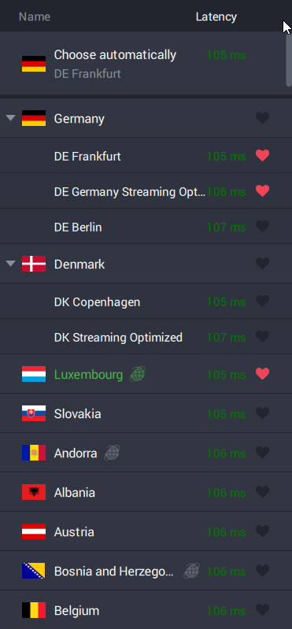

# `server-latency`

The VPN "PrivateInternetAccess", or PIA, offers a large number of servers in several countries. However, the official VPN GUI displays **incorrect latency measurements**, making it difficult to choose the best server based on latency.



*Luxembourg server shown with `105 ms`, my script reports `18 ms`, latter of which being **much** closer to what [https://speed.cloudflare.com/](https://speed.cloudflare.com/) and other internet speed tests report.*

***

✅ **This CLI script measures the actual latency to each server by sending ICMP echo requests (pings) and displays the results in a sorted table.**


## Requirements

- Python 3 & `pip` or [`uv`](https://docs.astral.sh/uv/)
- **Windows and Linux supported** & tested (likely works on macOS, too)

You do **not** need an active PIA/VPN subscription for this script to work.

The script was tested and works fine on (Debian-based) Linux servers.

## Setup

(Step 0. - Download or clone this repository.)

### 1. Fetch server list

Download `https://raw.githubusercontent.com/Lars-/PIA-servers/refs/heads/master/export.csv` and place its contents into `servers/export.csv` (replace existing file).

### 2. Install dependencies (only for `pip`)

```cmd
pip install -r requirements.txt
```

### 3. Run the script (without VPN enabled!)

⚠️ **Run the script from this directory!**

```cmd
py main.py
```

(or `uv run main.py` if using `uv`)

## Configuration

Currently, the script only supports selecting an entire continent, but don't worry, it doesn't take long (unless you set a very high amount of servers per region, see below).

If there is no `config.json` in *this* directory (`README.md`, `main.py` etc.), follow the instructions in the terminal, it will generate the file for you. To reset your config, simply delete said file.

The server latencies may change over time, feel free to use a higher amount of servers per region (again, delete `config.json` to reset config and rerun the script to change it).

## Geo-located servers and unexpected results

The results may seem surprising for so-called **Geo-located** regions (e.g. currently Andorra, Bosnia, Liechtenstein, Luxembourg, Montenegro, among many others). These servers report an IP in the respective country, but are actually physically located in another country and thus may have an entirely different latency than expected (sometimes for the better). From my tests, my script reports accurate results/latencies for these servers, as well.

## Tips for more accurate results & lower latency

Run speedtests like [https://speed.cloudflare.com/](https://speed.cloudflare.com/) a **few seconds after starting the VPN connection**, and **run it 2-3 times**, as the VPN connection may take a few seconds to stabilize.

More general tips:

- **Disable the Shadowsocks/multi-hop proxy**  (currently only affects OpenVPN) if you don't need it, it introduces ~50 ms of latency. 

- **Use UDP** (when using OpenVPN) - Similarily, I've seen a ~50 ms increase in latency when using TCP over UDP. UDP is slightly less reliable (some packets may get lost), but can have a significantly lower latency in some scenarios.

- Use **Large packets** MTU mode (recommended by PIA for more efficiency), again might be more less reliable in edge cases.

- Prefer **WireGuard over OpenVPN** if unsure, though in some rare cases OpenVPN might be slightly faster (try both).

Also make sure to check your own (i.e. non-VPN-tunneled) internet connection speed and latency.
